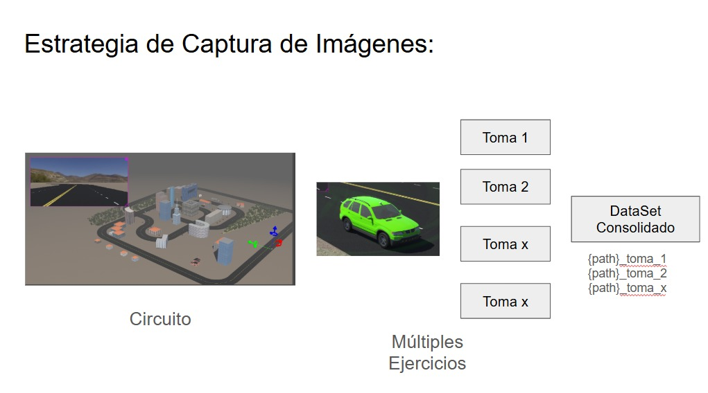

# 📁 Dataset de Simulación Webots

En esta sección se encuentran los datos generados por el simulador de **Webots**.

La metodología utilizada para crear estos datos fue conducir el simulador manualmente, generando imágenes suficientes para capturar el comportamiento adecuado para el modelo de conducción autónoma.

---

---

## 📦 Acceso a los Datos

- **Datos descomprimidos:**  
  [Google Drive - Carpeta](https://drive.google.com/drive/folders/1KOUTl7g9wrTE-dzRr4bkUaz91DkfKLSf?usp=share_link)

- **Datos en ZIP:**  
  [Google Drive - Archivo ZIP](https://drive.google.com/file/d/1j2iPlg9zh4YA_PqE5gpKLl2k4Q3Dvy0o/view?usp=share_link)

---

## 📝 Actualización 1

El dataset en su primera versión fue generado por **11 tomas diferentes**, con la siguiente distribución:

| Carpeta                                                                 | Cantidad de Imágenes |
|-------------------------------------------------------------------------|---------------------|
| `/toma_9`                                                               | 8,879               |
| `/toma_7`                                                               | 4,002               |
| `/toma_6`                                                               | 1,804               |
| `/toma_1`                                                               | 162                 |
| `/toma_8`                                                               | 4,742               |
| `/toma_4`                                                               | 757                 |
| `/toma_3`                                                               | 587                 |
| `/toma_11`                                                              | 2,429               |
| `/toma_10`                                                              | 5,476               |
| `/toma_2`                                                               | 365                 |
| `/toma_5`                                                               | 2,508               |
| `__MACOSX/1_DataSet/toma_9`                                             | 1                   |
| **Total**                                                               | **31,712**          |

---

> ℹ️ **Nota:** Los datos fueron generados y almacenados en Google Drive para facilitar su acceso y descarga.

---